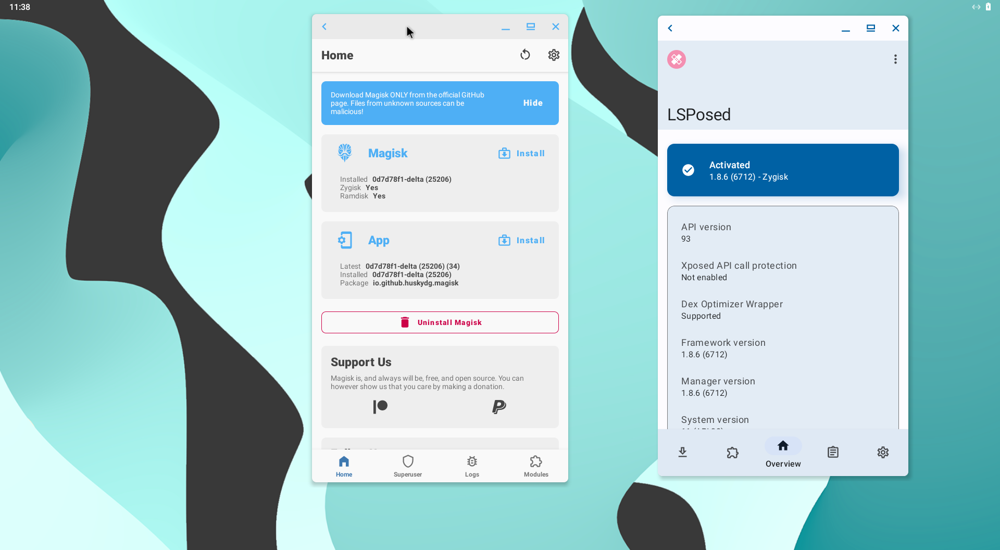
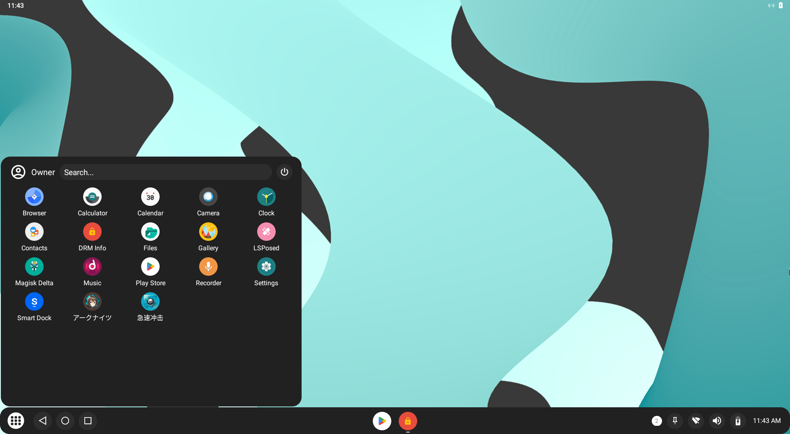
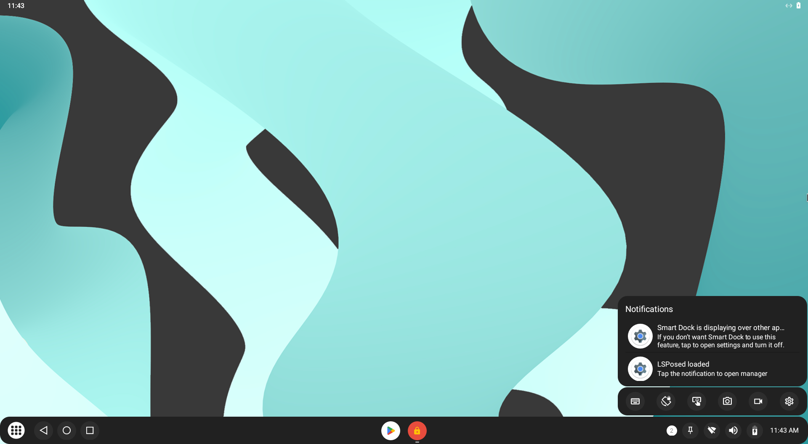

# Waydroid Extras Script
Script to add gapps and other stuff to waydroid !

# Installation/Usage
"lzip" and "sqlite" is required for this script to work, install it using your distribution's package manager:
## Arch, Manjaro and EndeavourOS based distributions:
	sudo pacman -S lzip sqlite
## Debian and Ubuntu based distributions:
	sudo apt install lzip sqlite  
## RHEL, Fedora and Rocky based distributions:
	sudo dnf install lzip sqlite
## openSUSE based distributions:
	sudo zypper install lzip sqlite
Then run:
	
    git clone https://github.com/casualsnek/waydroid_script
    cd waydroid_script
    sudo python3 -m pip install -r requirements.txt
    sudo python3 main.py install {gapps, magisk, libndk, libhoudini, smartdock}

## Install OpenGapps


Open terminal and switch to directory where "main.py" is located then run:

    sudo python3 main.py install gapps

Then launch waydroid with:

    waydroid show-full-ui

After waydroid has finished booting open terminal and switch to directory where "main.py" is located then run:

    sudo python3 main.py google
Copy the returned numeric ID open ["https://google.com/android/uncertified/?pli=1"](https://google.com/android/uncertified/?pli=1) enter the id and register it, you may need to wait upto 10-20 minutes for device to get registered, then clear Google Play Service's cache and try logging in !

## Install Magisk



Open terminal and switch to directory where "main.py" is located then run:

    sudo python3 main.py install magisk

Magisk will be installed on next boot ! 

Zygisk and modules like LSPosed should work now.

Please use `Direct Install into system partition` to update Magisk in Magisk manager.

This script only focuses on Magisk installation, if you need more management, please check https://github.com/nitanmarcel/waydroid-magisk

## Install libndk arm translation 

libndk_translation from guybrush firmware. 

libndk seems to have better performance than libhoudini on AMD.

Open terminal and switch to directory where "main.py" is located then run:

    sudo python3 main.py install libndk

## Install libhoudini arm translation

Intel's libhoudini for intel/AMD x86 CPU, pulled from Microsoft's WSA 11 image

houdini version: 11.0.1b_y.38765.m

houdini64 version: 11.0.1b_z.38765.m

Open terminal and switch to directory where "main.py" is located then run:

    sudo python3 main.py install libhoudini

## Integrate Widevine DRM (L3)


Open terminal and switch to directory where "main.py" is located then run:

    sudo python3 main.py install widevine

## Install Smart Dock




Open terminal and switch to directory where "main.py" is located then run:

    sudo python3 main.py install smartdock


## Get Android ID for device registration

You need to register you device with its it before being able to use gapps, this will print out your Android ID which you can use for device registration required for google apps:
Open terminal and switch to directory where "main.py" is located then run:

    sudo python3 main.py google

Star this repository if you find this useful, if you encounter problem create a issue on github !

## Error handling  

In case of error, if you retry immediately and it fails with this error 
```
==> Failed to resize image '/var/lib/waydroid/images/system.img' .. !  e2fsck 1.45.5 (07-Jan-2020)
/var/lib/waydroid/images/system.img is mounted.
e2fsck: Cannot continue, aborting.
```
You need to get the mounting point using `df | grep waydroid`. It will be something like `/dev/loopXXX`. Then, unmount it
```
sudo umount /dev/loopXXX
```
And re-run the script.

## Credits
- [WayDroid](https://github.com/waydroid/waydroid)
- [waydroid_script](https://github.com/casualsnek/waydroid_script)
- [Magisk Delta](https://huskydg.github.io/magisk-files/)
- [OpenGapps](https://github.com/opengapps/opengapps)
- [Smart Dock](https://github.com/axel358/smartdock)